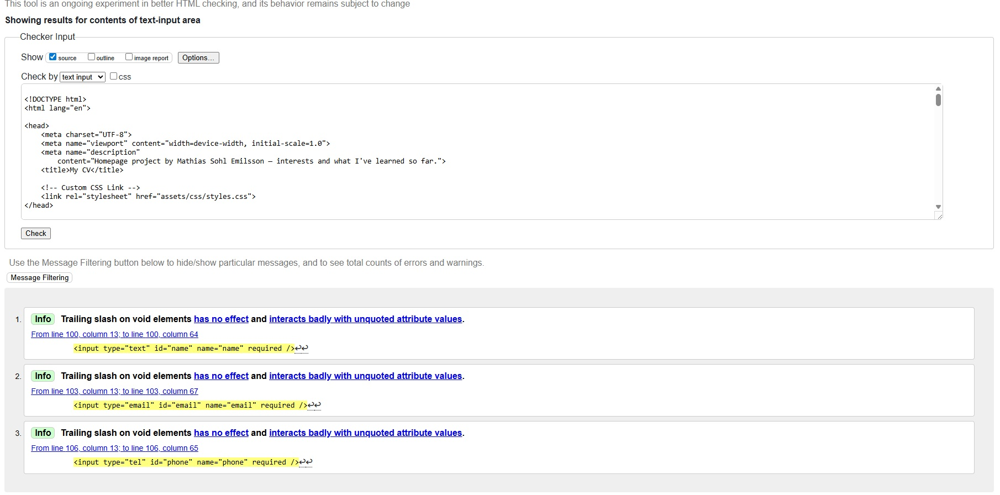
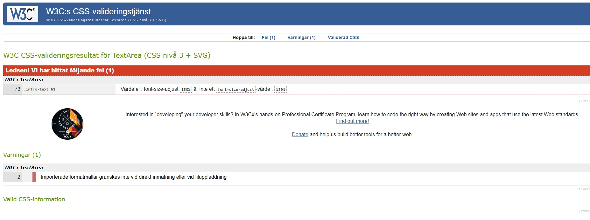
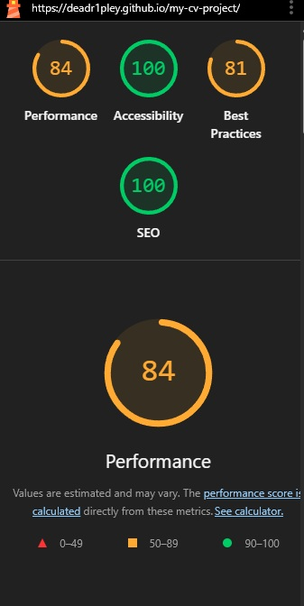
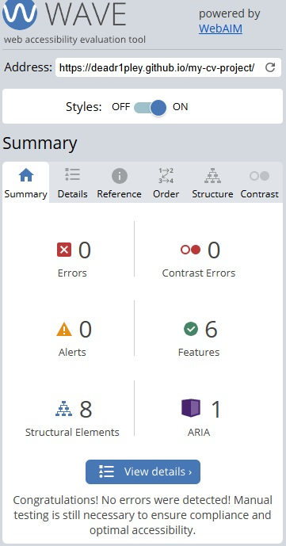

## Contents
- [Automated Testing](#automated-testing)
  - [W3C Validator](#w3c-validator)
  - [CSS Validation](#css-validation)
  - [Lighthouse](#lighthouse)
  - [WAVE](#wave)
- [Manual Testing](#manual-testing)
  - [Testing User Stories](#testing-user-stories)
  - [Full Testing](#full-testing)
- [Bugs](#bugs)
  - [Known Bugs](#known-bugs)
  - [Solved Bugs](#solved-bugs)

---

## Automated Testing

### W3C Validator
The HTML was tested with the official [W3C Markup Validation Service](https://validator.w3.org/).

**Result:**  
No errors were found. Only informational messages about self-closing input tags (`<input ... />`), which do not affect functionality.

---

### CSS Validation
The CSS was tested with the official [W3C Jigsaw CSS Validator](https://jigsaw.w3.org/css-validator/).

**Result:**  
- One error initially: `font-size-adjust: 130%` (not a valid value).  
  **Fix:** replaced with `font-size: 130%`.   
- One warning: imported CSS (Google Fonts) is not validated — does not affect the site.

---

### Lighthouse
Lighthouse was run in Chrome DevTools (Desktop mode).

**Results:**
- Performance: **84**
- Accessibility: **100**
- Best Practices: **81**
- SEO: **100**

---

### WAVE
The site was tested with the [WAVE Web Accessibility Evaluation Tool](https://wave.webaim.org/).

**Result:**  
- Errors: **0**  
- Contrast Errors: **0**  
- Alerts: **0**  
- Features: **6**  
- Structural Elements: **8**  
- ARIA: **1**

This indicates the site passes automated accessibility checks. Manual testing also confirmed readable text, clear focus order and accessible links.

---

## Manual Testing

### Testing User Stories
| User Story | How it was achieved | Screenshot |
|---|---|---|
| As a First Time Visitor, I want to easily understand who Mathias is | Hero section with name, welcome text and profile image | (assets/testing/picture-homepage.jpg) |
| As a Returning Visitor, I want to quickly find contact details | “Contact” section and footer contain email/social link | (assets/testing/picture-about-me.jpg) |
| As the Site Owner, I want to showcase my skills | About Me + page design demonstrating HTML/CSS/Bootstrap | (assets/testing/picture-contact-me.jpg) |

---

### Full Testing
The site was manually tested on:
- Desktop (Chrome, Firefox)
- Responsive mode for tablet and mobile sizes

**Checks performed:**
- Navbar links scroll to the correct sections
- External links open in a new tab (`target="_blank"` with `rel="noopener"`)
- Images load with descriptive `alt` text
- Layout is responsive (mobile/tablet/desktop)
- Contact form requires all fields (`required`)

---

## Bugs

### Known Bugs
- None at present.

### Solved Bugs
- Removed invalid CSS property `font-size-adjust: 130%`.
- Standardized form fields to English and fixed a missing closing `</textarea>` bracket.